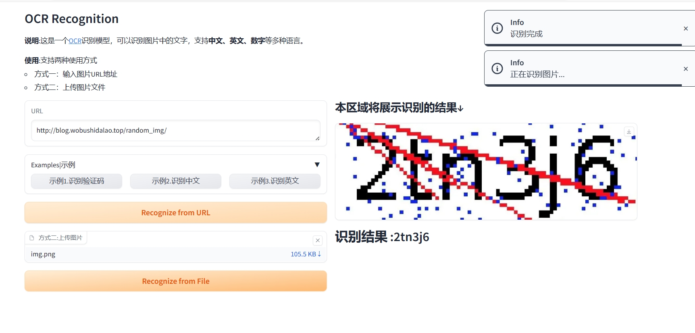
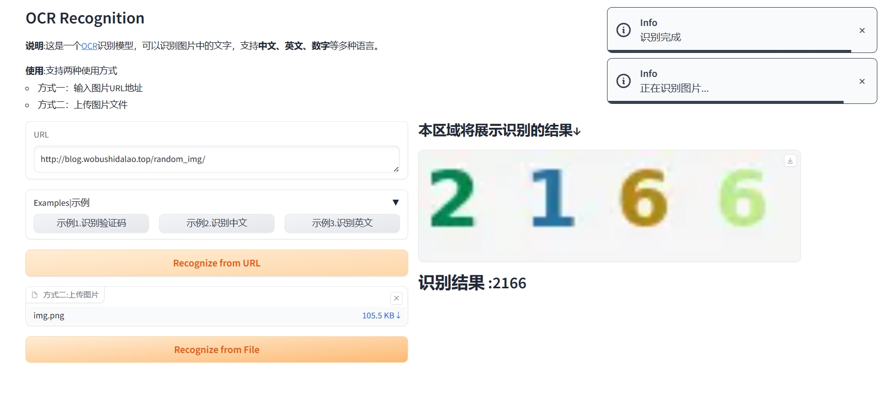

# ocr图像识别

## 简介

这是一个[读光-文字识别-行识别模型-中英-通用领域](https://www.modelscope.cn/models/iic/cv_convnextTiny_ocr-recognition-general_damo/feedback)
，本人在此开源模型的基础上，
使用[gradio](https://www.gradio.app/docs)进行了可视化封装部署。

**说明**:这是一个OCR识别模型，可以识别图片中的文字，支持**中文、英文、数字**等多种语言。

**使用**:支持两种使用方式

- 输入图片的URL地址
- 上传图片文件

## 如何运行

安装必要的第三方库

```shell
pip install opencv-python
pip install modelscope
...
```

在设备可以访问互联网的情况下，运行

```shell
python main.py
```

然后使用你的浏览器打开[http://127.0.0.1:7594/](http://127.0.0.1:7594/)即可

**效果如下**


